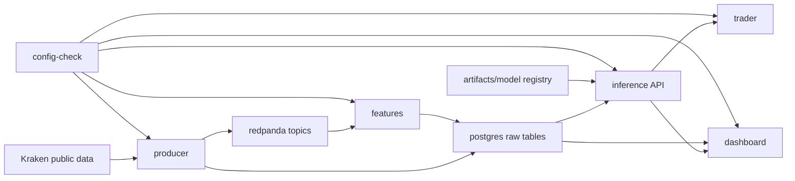

# Architecture

## High-Level Design

Stream Alpha separates runtime services from training and research workflows. Runtime services run in Docker Compose. Training and evaluation scripts run locally or in controlled operator flows and write artifacts under `artifacts/`.

## Service Roles

| Service | Role |
| --- | --- |
| `producer` | Runs `python -m app.ingestion.main`; connects to Kraken, publishes events, and persists raw data. |
| `features` | Runs `python -m app.features.main`; consumes raw events and writes feature rows. |
| `inference` | Runs `python -m app.inference`; loads model/runtime artifacts and serves FastAPI endpoints. |
| `trader` | Runs `python scripts/run_paper_trader.py`; calls inference and writes trading state. |
| `dashboard` | Runs `streamlit run dashboards/streamlit_app.py`; displays operational state. |
| `config-check` | Runs `python -m app.runtime.validate`; writes startup validation to `artifacts/runtime/startup_report.json`. |
| `postgres` | Stores raw, feature, trading, reliability, alert, adaptation, ensemble, and continual-learning tables. |
| `redpanda` | Kafka-compatible broker for raw data topics. |
| `redpanda-console` | Browser UI for Redpanda. |

## Runtime vs Training Boundary

Runtime dependencies are installed from `requirements-runtime.txt` in `docker/app.Dockerfile`. Training and research dependencies are installed from `requirements-training.txt` or the compatibility `requirements.txt`.

Runtime containers should load existing artifacts and serve the configured profile. Training scripts may create new artifacts, run model comparisons, and update local evidence, but no runtime promotion should be assumed unless a registry/runtime path confirms it.

