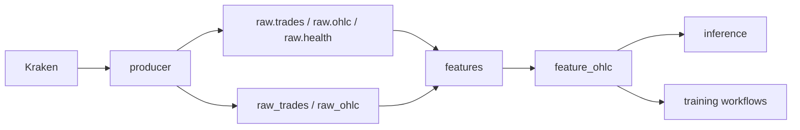

# Data Pipeline

## Market Data Ingestion

The `producer` service runs `python -m app.ingestion.main`.

Confirmed inputs:

- `KRAKEN_WS_URL`
- `KRAKEN_REST_OHLC_URL`
- `KRAKEN_SYMBOLS`
- `KRAKEN_OHLC_INTERVAL_MINUTES`

Confirmed topics:

- `raw.trades`
- `raw.ohlc`
- `raw.health`

Confirmed tables:

- `raw_trades`
- `raw_ohlc`
- `producer_heartbeat`

## Feature Generation

The `features` service runs `python -m app.features.main`.

It uses:

- `FEATURE_CONSUMER_GROUP_ID`
- `FEATURE_SERVICE_NAME`
- `FEATURE_FINALIZATION_GRACE_SECONDS`
- `FEATURE_BOOTSTRAP_CANDLES`

The confirmed feature table is `feature_ohlc`.

## Storage Flow



## Backfill and Imports

Visible scripts:

- `scripts/import_kraken_ohlcvt.ps1`
- `app.ingestion.backfill_ohlc`
- `scripts/export_feature_ohlc_for_colab.py`

The stack helper `scripts/start-stack.ps1` can run:

```powershell
docker compose `
  --profile <profile> `
  --env-file .env `
  run --rm producer `
  python -m app.ingestion.backfill_ohlc --lookback-candles 128
```

## Fallback Behavior

Feature and training readiness code contains database/table existence checks and fallback paths. Exact operator impact depends on the command being run. TODO: verify each fallback path before relying on it operationally.

