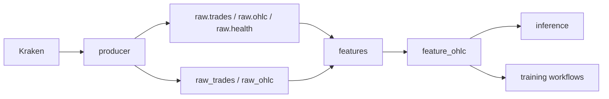

# Data Pipeline

## Market Data Ingestion

The `producer` service runs `python -m app.ingestion.main`.

Confirmed inputs:

- `KRAKEN_WS_URL`
- `KRAKEN_REST_OHLC_URL`
- `KRAKEN_SYMBOLS`
- `KRAKEN_OHLC_INTERVAL_MINUTES`

Confirmed topics:

- `raw.trades`
- `raw.ohlc`
- `raw.health`

Confirmed tables:

- `raw_trades`
- `raw_ohlc`
- `producer_heartbeat`

## Feature Generation

The `features` service runs `python -m app.features.main`.

It uses:

- `FEATURE_CONSUMER_GROUP_ID`
- `FEATURE_SERVICE_NAME`
- `FEATURE_FINALIZATION_GRACE_SECONDS`
- `FEATURE_BOOTSTRAP_CANDLES`

The confirmed feature table is `feature_ohlc`.

## Storage Flow



## Backfill and Imports

Visible scripts:

- `scripts/import_kraken_ohlcvt.ps1`
- `app.ingestion.backfill_ohlc`
- `scripts/export_feature_ohlc_for_colab.py`

The stack helper `scripts/start-stack.ps1` can run:

```powershell
docker compose `
  --profile <profile> `
  --env-file .env `
  run --rm producer `
  python -m app.ingestion.backfill_ohlc --lookback-candles 128
```

## Verified Operational Fallbacks

The following fallback paths are implemented in the producer, feature, import, and backfill code. The proof level column separates live Docker evidence from unit tests and code inspection.

| Area | Implemented fallback | Proof level | Evidence |
| --- | --- | --- | --- |
| Producer startup | Retries dependency startup for Postgres, Kafka/Redpanda publishing, and reliability storage with exponential backoff. | Docker-verified for healthy real dependencies; failure retry path code-inspected. | `app/ingestion/service.py` |
| Producer stream session | Reconnects after stream failures, subscription acknowledgement timeout, or session termination. | Code-inspected; disruptive websocket failure injection was not forced in Docker. | `app/ingestion/service.py` |
| Producer malformed payloads | Records malformed payloads as health events and continues processing. | Unit-tested through normalizer/publish tests; live malformed payload injection not safely forced. | `app/ingestion/service.py` |
| Producer health events | Publishes health events and heartbeat writes on a best-effort basis; failures are logged but do not stop the producer. | Docker-verified for running service logs; failure suppression path code-inspected. | `app/ingestion/service.py` |
| Feature consumer startup/runtime | Reconnects and retries after dependency or consume-loop failures with exponential backoff. | Docker-verified for healthy real dependencies; failure retry path code-inspected. | `app/features/service.py` |
| Feature bootstrap | Rebuilds in-memory feature state from existing `raw_ohlc` rows on startup. | Unit-tested and Docker-verified for the running feature service path. | `app/features/service.py`, `app/features/state.py` |
| Feature missing tables | Read-side bootstrap/replay queries return empty rows when the expected schema or tables do not exist yet. | Code-inspected; live table-drop validation was not run. | `app/features/db.py` |
| Feature malformed payloads | Skips malformed raw OHLC payloads and continues consuming. | Unit-tested where payload parsing is covered; live Kafka malformed payload injection not safely forced. | `app/features/service.py` |
| Feature stale candles | Finalizes stale current candles after the configured grace period. | Unit-tested. | `app/features/service.py`, `app/features/state.py` |
| Kraken REST backfill | Supports `--skip-raw-backfill` to replay from existing `raw_ohlc` rows and `--skip-feature-replay` to skip feature replay. | Unit-tested. | `app/ingestion/backfill_ohlc.py` |
| Kraken CSV import | Supports `--skip-raw-import` to replay from existing `raw_ohlc` rows and `--skip-feature-replay` to skip feature replay. | Unit-tested. | `app/ingestion/import_kraken_ohlcvt.py` |
| Raw and feature replay | Skips unchanged raw and feature rows on rerun, making imports/backfills idempotent for unchanged inputs. | Unit-tested. | `app/ingestion/backfill_ohlc.py`, `app/ingestion/import_kraken_ohlcvt.py` |
| Kraken CSV VWAP | Uses close price as a documented VWAP fallback when a seven-column Kraken CSV row does not include VWAP. | Unit-tested. | `app/ingestion/import_kraken_ohlcvt.py` |
| Local script DSN | Tries the configured Postgres DSN first, then a localhost DSN variant for local import/backfill workflows. | Code-inspected; not forced in Docker because the running stack already uses reachable configured service DNS. | `app/ingestion/backfill_ohlc.py` |

## Fallback Limits

- Kafka publish retry is handled at the producer service/session level. `app/ingestion/publisher.py` does not implement a separate per-message retry loop.
- Missing-table fallback is read-side only for bootstrap/replay reads. Writes still require a working database connection and schema creation path.
- Docker validation proves the current paper stack can run against real Redpanda and Postgres. It does not prove destructive failure cases that require stopping services, deleting tables, or injecting malformed live Kafka messages.
