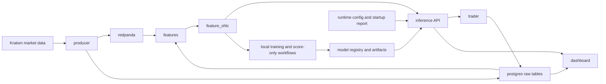

# Stream Alpha Project Report

## Executive Summary

Stream Alpha is a local-first crypto trading research and operations stack. It combines Docker Compose services, Redpanda/Kafka-compatible messaging, PostgreSQL storage, Python workers, a FastAPI inference API, a Streamlit dashboard, and local operator training workflows.

The current project state is stronger and more honest than the earlier baseline, but it is not complete through Second Foundation v2. The runtime truth surfaces for M19 and M21 now exist, and the M20 score-only proof path now completes. However, M20 remains `ACTIVE_WEAK` because both NeuralForecast specialists were rejected by incumbent comparison.

Current high-level status:

| Area | Status | Evidence |
| --- | --- | --- |
| M1-M18 baseline | Accepted baseline documented | `README.md`, `PLANS.md` |
| M19 adaptation truth | Runtime-generated persisted truth exists | `PLANS.md` records drift/performance persistence |
| M20 dynamic ensemble | Active but weak | Active roster remains narrow; latest specialists rejected |
| M21 continual learning | Guarded truth surfaces exist | Drift-cap persisted truth and guarded operator endpoints exist |
| Second Foundation v2 | Not complete through M21 | M20 remains not promotable |

## Project Purpose

Stream Alpha is built to support a controlled crypto trading workflow:

- ingest market data
- store raw and feature data
- build model-ready features
- serve predictions and signal metadata
- run paper, shadow, or live trading profiles
- expose operational health and evidence surfaces
- support offline model training, scoring, registry, and promotion research

The project is intentionally evidence-driven. A model or foundation claim counts only when there is real code support, real artifacts, registry/runtime discoverability, validation, and runtime usability.

## Runtime Stack

The runtime stack is Docker Compose based. The main services are:

| Service | Purpose |
| --- | --- |
| `redpanda` | Kafka-compatible broker for market data and operational events |
| `redpanda-console` | Broker inspection UI |
| `postgres` | Local relational storage for raw data, features, runtime state, and trading records |
| `config-check` | One-shot startup validation through `python -m app.runtime.validate` |
| `producer` | Kraken ingestion and event publishing |
| `features` | Feature consumer and feature-table writer |
| `inference` | FastAPI model runtime and operator API surface |
| `trader` | Paper/shadow/live trading runner |
| `dashboard` | Streamlit operator dashboard |

Runtime profiles are selected with `STREAMALPHA_RUNTIME_PROFILE`. The documented profiles are `dev`, `paper`, `shadow`, and `live`. The latest local Docker proof used the `paper` profile.

## Architecture

The runtime path separates live services from local training and research workflows.



Runtime containers should load existing artifacts and serve the configured profile. Training scripts may create artifacts, run comparisons, and update local evidence. A completed training run is not a promotion by itself.

## Data Pipeline

The data pipeline is:

1. `producer` ingests Kraken market data.
2. Raw events are published to Redpanda topics and persisted to PostgreSQL.
3. `features` consumes raw data and writes derived OHLC features.
4. `inference` reads fresh features and model artifacts to serve predictions and signals.
5. `trader` consumes signal decisions for paper, shadow, or live workflows.
6. The dashboard reads health, state, and evidence surfaces.

The docs record fallback paths for producer reconnects, feature bootstrap from `raw_ohlc`, idempotent import/backfill behavior, CSV VWAP fallback, and local DSN fallback. Some failure paths are code-inspected or unit-tested only because live destructive failure injection was intentionally not run.

## Runtime vs Training Dependencies

The dependency split is now explicit:

| File | Role |
| --- | --- |
| `requirements-runtime.txt` | Slim Docker service/runtime dependency set |
| `requirements-training.txt` | Heavier training and research dependency set |
| `requirements.txt` | Compatibility entrypoint for local development, pointing at training dependencies |
| `requirements-docs.txt` | MkDocs documentation build dependencies |

The Docker app image installs runtime dependencies only and uses BuildKit pip caching. The training dependency set keeps heavier research packages out of normal service images.

## Docker Operations

The app services share the `streamalpha-app:latest` image. The Docker slimming batch reduced duplicate service images and documented safe cleanup.

Important Docker safety rules:

- Do not run `docker system prune --volumes` unless intentionally deleting volumes.
- Do not manually delete `docker_data.vhdx`.
- Stop Docker Desktop and WSL before compacting the Docker VHDX.
- Keep Postgres and Redpanda volumes unless a deliberate data reset is intended.

Docker Desktop with WSL2 stores engine data by default under:

```text
C:\Users\[USERNAME]\AppData\Local\Docker\wsl
```

Docker Desktop storage can be moved through:

```text
Settings -> Resources -> Advanced -> Disk image location
```

## Foundation Status

### M1-M18

The project has accepted baseline documentation through M18. These foundations cover the original data, feature, offline training, runtime inference, risk, execution, reliability, explainability, operator console, deployment, alerting, and evaluation surfaces.

### M19

M19 now has runtime-generated persisted drift and performance truth. This should be read as bounded adaptation evidence, not as proof of strong adaptive profile activity or automatic promotion.

### M20

M20 dynamic ensemble surfaces and persisted profile truth exist, but M20 remains `ACTIVE_WEAK`.

Current M20 truth:

- the active runtime roster is aligned to a real registry-backed AutoGluon generalist
- the candidate ecosystem is still narrow
- real specialist evidence is now available from score-only proof
- both NeuralForecast specialists were rejected by incumbent comparison
- no promotion or runtime roster change happened from the latest M20 run

### M21

M21 guarded continual-learning surfaces exist, including runtime-generated drift-cap truth and operator/internal POST endpoints protected by `STREAMALPHA_OPERATOR_API_KEY`.

This does not mean uncontrolled live self-retraining exists. The repo should not claim active continual-learning profiles, experiments, or promotions unless persisted state proves them.

## M20 Score-Only Proof

Latest completed score-only artifact:

```text
artifacts/training/m20/20260427T112021Z
```

Source fitted models:

```text
artifacts/training/m20/20260405T023104Z/fitted_models
```

Score-only recent-window proof:

| Field | Value |
| --- | --- |
| Execution mode | `score_only` |
| Recent cutoff | `2025-04-02T11:35:00Z` |
| Eligible recent fold test rows | `236153/1487233` |
| Skipped old folds | `[0, 1, 2, 3]` |
| Winner | `neuralforecast_patchtst` |
| Acceptance scope | `recent_window` |
| Verdict basis | `incumbent_comparison` |
| Incumbent model version | `m7-20260401T043003Z` |
| Meets acceptance target | `False` |

Specialist verdicts:

| Specialist | Role | Verdict | Basis |
| --- | --- | --- | --- |
| `neuralforecast_nhits` | `TREND_SPECIALIST` | `rejected` | `incumbent_comparison` |
| `neuralforecast_patchtst` | `RANGE_SPECIALIST` | `rejected` | `incumbent_comparison` |

This proves the M20 score-only path can complete with incumbent comparison. It does not prove M20 is strong or promotable.

## Recent Local Fixes

The current worktree includes local uncommitted M20 scoring/reporting changes. Until committed, this report describes them as local current state.

Recent local changes include:

- score-only scoring now limits fold evaluation to the configured recent window
- old folds with no recent rows are skipped
- `run_config.json` records `score_only_recent_window`
- long NeuralForecast console progress output is best-effort so Windows console failures do not abort scoring
- scoring checkpoints can resume from cached raw scores

## API and Operator Controls

The inference service exposes public read-only health and prediction surfaces, plus guarded operator/internal continual-learning POST endpoints.

State-changing continual-learning endpoints require:

```text
STREAMALPHA_OPERATOR_API_KEY
X-StreamAlpha-Operator-Key
```

Protected endpoints deny by default if the configured key is unset, blank, missing, or wrong. `/health` remains public.

## Validation Summary

Recent documented validation includes:

| Area | Validation |
| --- | --- |
| Docs | `python -m mkdocs build --strict` passed in prior docs batches |
| Docs CI | GitHub Actions Docs workflow builds MkDocs on push and pull request |
| Validation CI | GitHub Actions Validation runs focused training checks on Python 3.11 |
| Docker | Paper stack ps/log/health checks passed with Postgres, Redpanda, and inference healthy |
| Runtime deps | Runtime/training dependency dry-run checks passed |
| Continual-learning auth | Focused API tests passed |
| M20 recent scoring | Focused training/script tests passed |
| M20 score-only proof | Completed artifact produced `summary.json` with incumbent comparison |

Most recent local focused checks recorded in `PLANS.md`:

```powershell
python -m pytest tests/test_training_service.py tests/test_training_neuralforecast.py -q
python -m pytest tests/test_training_scripts.py tests/test_training_specialist_verdicts.py -q
python -m compileall -q app/training tests/test_training_service.py tests/test_training_neuralforecast.py
powershell -NoProfile -ExecutionPolicy Bypass -File scripts/rescore_m20_training.ps1 -DryRun
```

## Operations Commands

Inspect latest M20 status:

```powershell
powershell -NoProfile -ExecutionPolicy Bypass -File scripts/status_m20_training.ps1
```

Run M20 score-only dry run:

```powershell
powershell -NoProfile -ExecutionPolicy Bypass -File scripts/rescore_m20_training.ps1 -DryRun
```

Build docs:

```powershell
python -m pip install -r requirements-docs.txt
python -m mkdocs build --strict
```

Start paper stack:

```powershell
docker compose --profile paper --env-file .env up -d
```

Check services:

```powershell
docker compose --profile paper --env-file .env ps
Invoke-RestMethod http://127.0.0.1:8000/health
```

## Risks and TODOs

- Second Foundation v2 is not honestly complete through M21 yet.
- M20 remains `ACTIVE_WEAK`.
- M20 is not promotable from the latest score-only run.
- The current specialist evidence is negative after incumbent comparison.
- Runtime model diversity is still narrower than the design intent.
- Some data-pipeline failure paths remain intentionally not live-tested because they require disruptive failure injection.
- Current M20 recent-only and console-failure fixes are local worktree state until committed.
- Promotion and runtime roster changes should not be inferred from training or scoring artifacts alone.

## Bottom Line

The project has moved from "blocked proof" to "completed proof with negative result" for M20. That is real progress: the system can now score the specialists, compare them against the incumbent, and produce an auditable verdict.

The honest conclusion is still conservative. Stream Alpha has useful runtime and evidence surfaces, but Second Foundation v2 is not complete until the model ecosystem and M20/M21 evidence become strong enough to support that claim.
